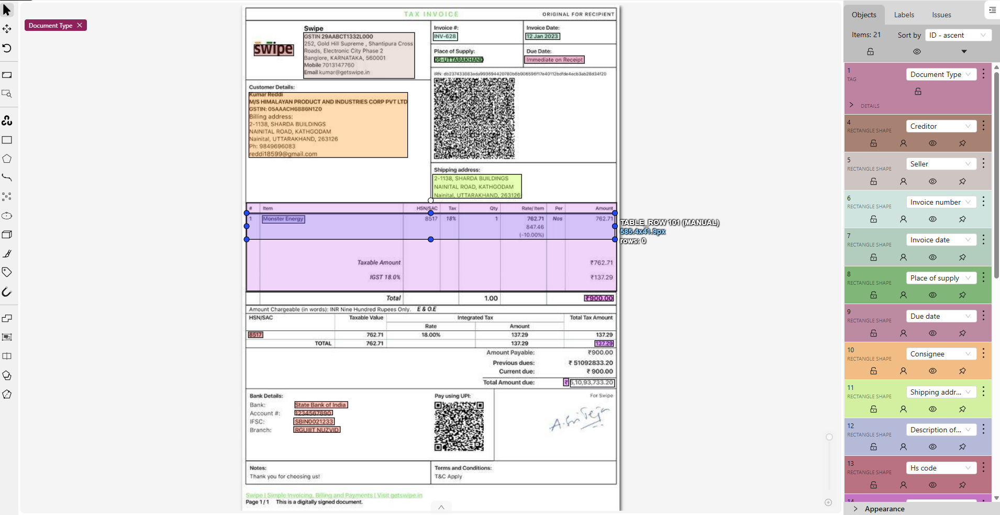
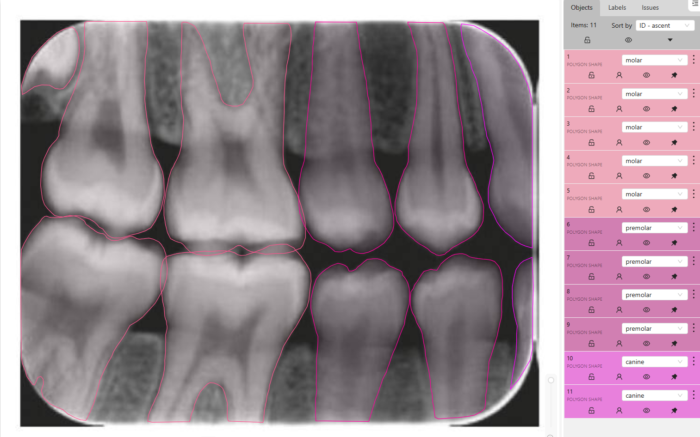

# AI Annotation Portfolio

## About Me
AI Data Operations and Annotation Specialist focused on:

- Retail Shelf Annotation
- OCR Document Annotation
- Medical Image Annotation
- Data Quality Validation
- Bounding Box & Polygon Annotation
- Computer Vision Dataset Preparation

---

# Annotation Domains

## Retail Shelf Annotation
Project focused on:
- Product detection
- SKU grouping
- Price tag annotation
- Shelf segmentation
- Product classification

### Included Samples
- Grocery shelves
- Beverage shelves
- Product grouping
- Retail segmentation

Tools:
- CVAT
- Polygon Annotation
- Bounding Box Annotation

---

## OCR Document Annotation
Project focused on:
- Invoice annotation
- Table annotation
- Air waybill extraction
- Packing list extraction
- Key-value pair extraction

### Included Samples
- Tax invoices
- Logistics documents
- OCR extraction workflow
- Table structure annotation

Tools:
- CVAT
- OCR Mapping
- Rectangle Annotation

---

## Medical Image Annotation
Project focused on:
- Dental X-ray annotation
- Tooth segmentation
- Caries detection
- Root canal annotation
- Filling and implant annotation

### Included Samples
- Dental panoramic X-rays
- Tooth classification
- Medical segmentation
- Cavity detection

Tools:
- Polygon Annotation
- Medical Segmentation
- CVAT

---

# Skills

- Data Annotation
- Data Quality Assurance
- Computer Vision Annotation
- Medical Image Annotation
- OCR Annotation
- Bounding Box Annotation
- Polygon Annotation
- Segmentation
- Dataset Preparation

---

# Annotation Tools

- CVAT
- Label Studio
- Supervisely
- Roboflow

---

# Portfolio Repository Structure

# Project Navigation

## Retail Shelf Annotation
🔗 [Open Project](./retail-shelf-annotation)

Focus Areas:
- Product detection
- Shelf segmentation
- Price tag annotation
- SKU grouping

---

## OCR & Document Annotation
🔗 [Open Project](./document-ocr-annotation)

Focus Areas:
- Invoice extraction
- Table annotation
- OCR workflows
- Logistics document processing

---

## Medical Image Annotation
🔗 [Open Project](./medical-image-annotation)

Focus Areas:
- Dental X-ray annotation
- Tooth segmentation
- Caries detection
- Medical polygon annotation

# Portfolio Preview

## Retail Shelf Annotation

---

## OCR Document Annotation

---

## Medical Image Annotation

# Contact

GitHub: https://github.com/sujith96-dta

LinkedIn:
https://www.linkedin.com/in/sujith-k-s-65b524186
